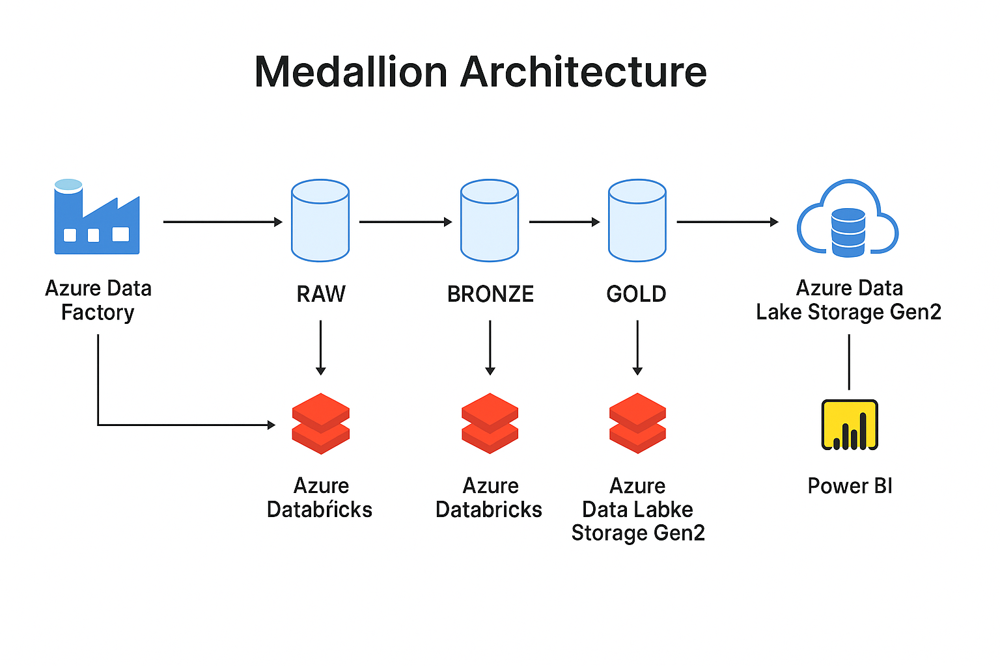

# earthquake-data-pipeline

A complete enterprise-style data pipeline for earthquake data using Databricks and Delta Lake, following the medallion architecture (RAW → BRONZE → SILVER → GOLD). The data is ingested daily from the USGS Earthquake API and processed for analytics, reporting, and future machine learning use cases.

# Earthquake Data Pipeline

This project is a complete end-to-end solution for ingesting, transforming, analyzing, and visualizing earthquake data from the USGS API using a modern Azure-based architecture. The design follows best practices for enterprise-grade data pipelines, using layered storage (medallion architecture), orchestrated workflows, and advanced monitoring and visualization.

---

## 🔍 Purpose

The primary goal of this pipeline is to:

- Provide clean, enriched, and aggregated earthquake data for reporting and decision-making.
- Implement a real-world medallion architecture with clean separation between RAW, BRONZE, SILVER, and GOLD layers.
- Enable automated orchestration (ADF), scalable compute (Databricks), alerting (Monitor), and visualization (Power BI).

---

## 🔁 Pipeline Flow



The pipeline performs the following steps:

1. **Data ingestion** (ADF): JSON data is retrieved daily from the USGS API.
2. **Raw zone**: The raw API response is saved to Azure Data Lake Gen2.
3. **Bronze** (Databricks): Parses JSON, extracts structured fields like ID, magnitude, coordinates, etc.
4. **Silver** (Databricks): Deduplicates, enriches, and adds derived columns like `day_ratio`, `depth_category`, etc.
5. **Gold** (Databricks): Aggregates by date and region. Calculates KPIs: `avg_mag`, `total_eq`, `strong_eq`, `felt_pct`, `tsunami_pct`, etc.
6. **Gold History**: Stores all daily aggregations over time (append-only).
7. **Power BI**: Reads CSV exports from the GOLD layer to create dashboards.

---

## ☁️ Azure Components Used

- **Azure Data Factory**: Executes the full ETL flow via linked notebooks and copy activities.
- **Azure Data Lake Storage Gen2**: Stores all layers of data.
- **Azure Databricks**: Runs transformation logic in PySpark notebooks.
- **Power BI Desktop**: Visualizes daily and historical metrics.
- **Azure Monitor**: Sends email alerts on pipeline success/failure.

---

## 🧱 Layered Storage Layout

```bash
/earthquakes
├── raw/              # raw USGS API output (JSON)
├── bronze/           # normalized flat structure (Delta)
├── silver/           # cleaned, enriched data
├── gold/             # snapshot (merge/update per region+day)
├── gold_history/     # append-only daily metrics
├── gold_exports/     # CSV output for Power BI
```

---

## 📊 Visualizations in Power BI

This pipeline supports a variety of visuals:

- **Bar chart**: total_eq per region (colored by avg_mag)
- **Map**: location-based earthquakes with size by magnitude
- **Line chart**: magnitude trend over time
- **Pie chart**: depth distribution (shallow, intermediate, deep)
- **Slicers**: by `region_country` and `date` for filtering

These visuals are defined in the Power BI file: `powerbi/earthquake-dashboard.pbix`  
A static PDF version is also included: `earthquake-dashboard.pdf`

---

## 📣 Alerts and Monitoring

- **Success alert**: `adf_pipeline_success` → email if pipeline runs OK
- **Failure alert**: `adf_pipeline_failed` → email on any error
- Managed via Azure Monitor and Action Groups.

---

## 🧠 Possible Enhancements

- Live dashboard via Power BI Service + Gateway
- Training ML models on `gold_history` (for magnitude prediction)
- Export GOLD to Synapse or Azure SQL for analytics
- Custom alerts on `strong_eq > threshold` for public safety

---

## 📁 Project Structure

```bash
earthquake-data-pipeline/
├── PowerBI plots/              # Power BI reports and visual exports
├── dataset/                    # ADF datasets in JSON
├── factory/                    # ADF factory definition
├── linkedService/              # Linked service configs for ADF
├── notebooks-DataBricks/       # Databricks notebooks
├── pipeline/                   # ADF pipelines in JSON
├── trigger/                    # ADF trigger definition
├── README.md                   # Project documentation
├── .gitignore
└── publish_config.json
```
